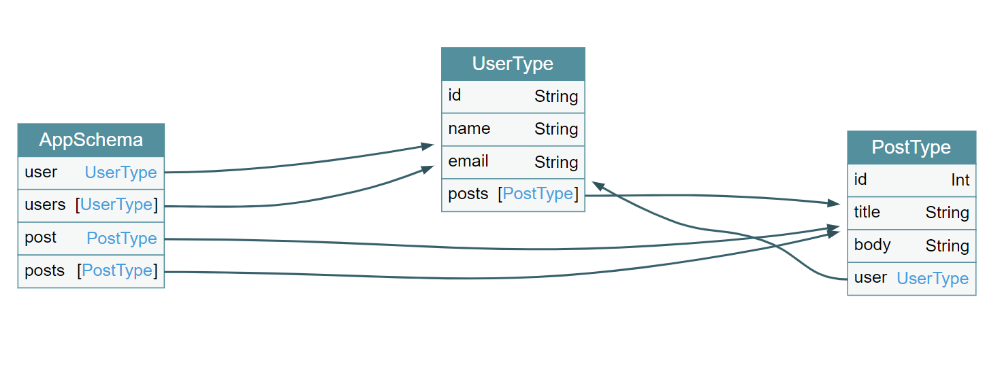

First challenge 
HL{Z6cZLf1E34sBtcTM3SE5}

Twizzle - 

350, 337, 335, 330, 329, 324, 320, 319, 318, 317, 316, 314,313, 
interesting things - twizzle means circular does it mean a number series
is this guy following ssomenone a cyclist which is again circular
https://edublognss.wordpress.com/2013/04/16/famous-mathematical-sequences-and-series/
why 359 tweets if the numer is 361

No flag in tweets

Steghide- 
1) ./configure 
2) make
3) make check
4) make install (as root)

libmhash is missing

San Pedro Newspaper
Historians found out that the very old issue of the "San Perdo Newspaper" contains a legendary crossword. The whole issue from 20th of April 1942 is protected by a paywall. Can you crack the paywall and solve the crossword?

client side is the best side 2
$(document).ready(function() {
        $("#check").click(function() {
            var pass = $('#password').val();
            console.log(SHA420(pass));
			$("#ok").show();
            if (pass.length==30 && "b0218147908009cec91e52147db8334162e332e060ba25f6db450a177d8c4c078e9e46a6ecd54f0c62ff9e19b6856a1821e2ff6712442b55a2a29697675697a2" == SHA420(pass)){
			   $("#ok").text("Very niice! This is your flag: "+pass);
            }else{
			   $("#ok").text("Nope :(");
			}
            return false;
        });
});

Substitution cipher

TLS dance
	152.96.7.8
    	tcp
        	7ad1fc0b-f28f-4fa4-af60-5c85c4c5c910.rdocker.vuln.land
            	443

Hint TLS dance : Cha cha cha

ChaCha stream cipher
https://tools.ietf.org/id/draft-mavrogiannopoulos-chacha-tls-01.html
https://superuser.com/questions/924261/manipulation-of-https-method-in-telnet

using Openssl for https website
https://www.bearfruit.org/thoughts/telnet-for-testing-ssl-https-websites/

https://docs.pingidentity.com/bundle/solution-guides/page/iqs1569423823079.html

openssl s_client -connect 152.96.7.8:443 -cipher ChaCha20-Poly1305

TLS_CHACHA20_POLY1305_SHA256:

ECDHE-ECDSA-CHACHA20-POLY1305:
ECDHE-RSA-CHACHA20-POLY1305:
DHE-RSA-CHACHA20-POLY1305:

RSA-PSK-CHACHA20-POLY1305:
DHE-PSK-CHACHA20-POLY1305:
ECDHE-PSK-CHACHA20-POLY1305:
PSK-CHACHA20-POLY1305:

TLS_CHACHA20_POLY1305_SHA256 - TLS_CHACHA20_POLY1305_SHA256 TLSv1.3 Kx=any      Au=any  Enc=CHACHA20/POLY1305(256) Mac=AEAD

S_ECDHE_ECDSA_WITH_CHACHA20_POLY1305_SHA256 - ECDHE-ECDSA-CHACHA20-POLY1305 TLSv1.2 Kx=ECDH     Au=ECDSA Enc=CHACHA20/POLY1305(256) Mac=AEAD
TLS_ECDHE_RSA_WITH_CHACHA20_POLY1305_SHA256 - ECDHE-RSA-CHACHA20-POLY1305 TLSv1.2 Kx=ECDH     Au=RSA  Enc=CHACHA20/POLY1305(256) Mac=AEAD
TLS_DHE_RSA_WITH_CHACHA20_POLY1305_SHA256 - DHE-RSA-CHACHA20-POLY1305 TLSv1.2 Kx=DH       Au=RSA  Enc=CHACHA20/POLY1305(256) Mac=AEAD

TLS_RSA_PSK_WITH_CHACHA20_POLY1305_SHA256 - RSA-PSK-CHACHA20-POLY1305 TLSv1.2 Kx=RSAPSK   Au=RSA  Enc=CHACHA20/POLY1305(256) Mac=AEAD
TLS_DHE_PSK_WITH_CHACHA20_POLY1305_SHA256 - DHE-PSK-CHACHA20-POLY1305 TLSv1.2 Kx=DHEPSK   Au=PSK  Enc=CHACHA20/POLY1305(256) Mac=AEAD
TLS_ECDHE_PSK_WITH_CHACHA20_POLY1305_SHA256 - ECDHE-PSK-CHACHA20-POLY1305 TLSv1.2 Kx=ECDHEPSK Au=PSK  Enc=CHACHA20/POLY1305(256) Mac=AEAD

TLS_PSK_WITH_CHACHA20_POLY1305_SHA256 - PSK-CHACHA20-POLY1305   TLSv1.2 Kx=PSK      Au=PSK  Enc=CHACHA20/POLY1305(256) Mac=AEAD

TLS_AES_256_GCM_SHA384  TLSv1.3 Kx=any      Au=any  Enc=AESGCM(256) Mac=AEAD
TLS_CHACHA20_POLY1305_SHA256 TLSv1.3 Kx=any      Au=any  Enc=CHACHA20/POLY1305(256) Mac=AEAD
TLS_AES_128_GCM_SHA256  TLSv1.3 Kx=any      Au=any  Enc=AESGCM(128) Mac=AEAD
ECDHE-ECDSA-AES256-GCM-SHA384 TLSv1.2 Kx=ECDH     Au=ECDSA Enc=AESGCM(256) Mac=AEAD
ECDHE-RSA-AES256-GCM-SHA384 TLSv1.2 Kx=ECDH     Au=RSA  Enc=AESGCM(256) Mac=AEAD
DHE-RSA-AES256-GCM-SHA384 TLSv1.2 Kx=DH       Au=RSA  Enc=AESGCM(256) Mac=AEAD
ECDHE-ECDSA-CHACHA20-POLY1305 TLSv1.2 Kx=ECDH     Au=ECDSA Enc=CHACHA20/POLY1305(256) Mac=AEAD
ECDHE-RSA-CHACHA20-POLY1305 TLSv1.2 Kx=ECDH     Au=RSA  Enc=CHACHA20/POLY1305(256) Mac=AEAD
DHE-RSA-CHACHA20-POLY1305 TLSv1.2 Kx=DH       Au=RSA  Enc=CHACHA20/POLY1305(256) Mac=AEAD
ECDHE-ECDSA-AES128-GCM-SHA256 TLSv1.2 Kx=ECDH     Au=ECDSA Enc=AESGCM(128) Mac=AEAD
ECDHE-RSA-AES128-GCM-SHA256 TLSv1.2 Kx=ECDH     Au=RSA  Enc=AESGCM(128) Mac=AEAD
DHE-RSA-AES128-GCM-SHA256 TLSv1.2 Kx=DH       Au=RSA  Enc=AESGCM(128) Mac=AEAD
ECDHE-ECDSA-AES256-SHA384 TLSv1.2 Kx=ECDH     Au=ECDSA Enc=AES(256)  Mac=SHA384
ECDHE-RSA-AES256-SHA384 TLSv1.2 Kx=ECDH     Au=RSA  Enc=AES(256)  Mac=SHA384
DHE-RSA-AES256-SHA256   TLSv1.2 Kx=DH       Au=RSA  Enc=AES(256)  Mac=SHA256
ECDHE-ECDSA-AES128-SHA256 TLSv1.2 Kx=ECDH     Au=ECDSA Enc=AES(128)  Mac=SHA256
ECDHE-RSA-AES128-SHA256 TLSv1.2 Kx=ECDH     Au=RSA  Enc=AES(128)  Mac=SHA256
DHE-RSA-AES128-SHA256   TLSv1.2 Kx=DH       Au=RSA  Enc=AES(128)  Mac=SHA256
ECDHE-ECDSA-AES256-SHA  TLSv1 Kx=ECDH     Au=ECDSA Enc=AES(256)  Mac=SHA1
ECDHE-RSA-AES256-SHA    TLSv1 Kx=ECDH     Au=RSA  Enc=AES(256)  Mac=SHA1
DHE-RSA-AES256-SHA      SSLv3 Kx=DH       Au=RSA  Enc=AES(256)  Mac=SHA1
ECDHE-ECDSA-AES128-SHA  TLSv1 Kx=ECDH     Au=ECDSA Enc=AES(128)  Mac=SHA1
ECDHE-RSA-AES128-SHA    TLSv1 Kx=ECDH     Au=RSA  Enc=AES(128)  Mac=SHA1
DHE-RSA-AES128-SHA      SSLv3 Kx=DH       Au=RSA  Enc=AES(128)  Mac=SHA1
AES256-GCM-SHA384       TLSv1.2 Kx=RSA      Au=RSA  Enc=AESGCM(256) Mac=AEAD
AES128-GCM-SHA256       TLSv1.2 Kx=RSA      Au=RSA  Enc=AESGCM(128) Mac=AEAD
AES256-SHA256           TLSv1.2 Kx=RSA      Au=RSA  Enc=AES(256)  Mac=SHA256
AES128-SHA256           TLSv1.2 Kx=RSA      Au=RSA  Enc=AES(128)  Mac=SHA256
AES256-SHA              SSLv3 Kx=RSA      Au=RSA  Enc=AES(256)  Mac=SHA1
AES128-SHA              SSLv3 Kx=RSA      Au=RSA  Enc=AES(128)  Mac=SHA1

 openssl s_client -connect 152.96.7.8:443 -cipher ECDHE-RSA-CHACHA20-POLY1305
CONNECTED(00000006)
Can't use SSL_get_servername
depth=0 C = UK, ST = England, L = London, O = localhost, OU = localhost, CN = localhost, emailAddress = admin@localhost
verify error:num=1820:certificate has expired
notAfter=Feb 15 08:04:30 2017 GMT
verify return:1
depth=0 C = UK, ST = England, L = London, O = localhost, OU = localhost, CN = localhost, emailAddress = admin@localhost
notAfter=Feb 15 08:04:30 2017 GMT
verify return:1
---
Certificate chain
 0 s:C = UK, ST = England, L = London, O = localhost, OU = localhost, CN = localhost, emailAddress = admin@localhost
   i:C = UK, ST = England, L = London, O = localhost, OU = localhost, CN = localhost, emailAddress = admin@localhost
---
Server certificate
-----BEGIN CERTIFICATE-----
MIIDljCCAn4CCQDiGU3GuzXKCDANBgkqhkiG9w0BAQUFADCBjDELMAkGA1UEBhMC
VUsxEDAOBgNVBAgMB0VuZ2xhbmQxDzANBgNVBAcMBkxvbmRvbjESMBAGA1UECgwJ
bG9jYWxob3N0MRIwEAYDVQQLDAlsb2NhbGhvc3QxEjAQBgNVBAMMCWxvY2FsaG9z
dDEeMBwGCSqGSIb3DQEJARYPYWRtaW5AbG9jYWxob3N0MB4XDTE2MDIxNjA4MDQz
MFoXDTE3MDIxNTA4MDQzMFowgYwxCzAJBgNVBAYTAlVLMRAwDgYDVQQIDAdFbmds
YW5kMQ8wDQYDVQQHDAZMb25kb24xEjAQBgNVBAoMCWxvY2FsaG9zdDESMBAGA1UE
CwwJbG9jYWxob3N0MRIwEAYDVQQDDAlsb2NhbGhvc3QxHjAcBgkqhkiG9w0BCQEW
D2FkbWluQGxvY2FsaG9zdDCCASIwDQYJKoZIhvcNAQEBBQADggEPADCCAQoCggEB
ALtT2NQIXvVC7DD05AGkgaCF/dViK4AtgbC5j02ayjcAOzfBP12tkjD4MnHqL/Kz
NGCGQHNuTGFGWkO5lrMldOLR9CXtVfqwiPU/llRIRjASWzTEkmPD9zTPropwsav2
wejRXm7p01NW2l6tfeCsvXuRUMsDL52TZAG3jlZQ4gae44MYg1nWtEC11iCjKSD1
B7goswSetNHSzu9t8B49NIycF2AzYSEZoe184XMaD6w/JoE8jAEmkXU6UblmcGwY
55fzwKyCp5q93tVWWLtRM5N8xnypW/8WutR8vQVsZGV0rHr92aApVIHZIQLhRL9F
9N7clYeRszjIDObws5Lz8VkCAwEAATANBgkqhkiG9w0BAQUFAAOCAQEAf1Mk3VXU
O2nsOl3Cxr1RY8dFzqJRWaKhT+6C+maWmI599D8yWMzU4ozjbfdTTrXxkjgdf82c
PthBRjtbj2a0yLP6XPAkLPo6Z+biV/S/hCf9HUMs4AiPAXMwmjFipwqT/fCIChYe
TF7ZC/QSfukjKQ6iLHVsJHDQS2DsP0A0q+cKlxxnQqLzvOEKidu2TTZnFUD5Z32Y
gAaXN/ae5t0xd+yqJLVoKp0azWsOsGpyyQCJQH/2/p60WAwyaSxoOT8XyDY50sfu
R3il5I4WDPw/3dniWovoVmhyjyjVV750/6fgEyHu98LhAq3e4qM6YH6EIyRuN56V
ZrsF0yyago6Dkg==
-----END CERTIFICATE-----
subject=C = UK, ST = England, L = London, O = localhost, OU = localhost, CN = localhost, emailAddress = admin@localhost

issuer=C = UK, ST = England, L = London, O = localhost, OU = localhost, CN = localhost, emailAddress = admin@localhost

---
No client certificate CA names sent
Peer signing digest: SHA256
Peer signature type: RSA-PSS
Server Temp Key: X25519, 253 bits😩🚵🚵😔🙁😹🚂😺🙁😅😔🚡🚤🚬😔😝🚬🚼🚵😩🚥🚬😭🚬🚉🙁😔🚥🚤😩😝😩🚥🙁🚬😝😺😔😩😝🚬😔🚠😭🚶🚜🚂😐😺🚴😔🚏🚤🚶😔🚧🚶🚬😺🚉😐🙁😔🚵🚶😑🚬😔🙁🚤🚬😭
🙋🙋🙋😯😯🚡🚶😔🚼😝🚶😑🚬😔🙁🚤😩🙁😔🚦🚶🚪😔😩😝🚬😔🚝🚶🚶🚧😔🚬🚉🚶🚪🚝🚤😧😔🚪😺🚬😔🙁🚤🚬😔🚎🚶🚵🚵🚶😹🚂🚉🚝😔😹🚶😝🚧😅😯😯🚀🙍😗🚬😭🚶🚜
😾😺😅🚈🚬🚭😺🙁🚟🚟🚼🚂🚧😋😯😯🚡🚤🚬😔🚀😩🚥🚓🚂🚉🚝🚯🙍😩🚈😔🚡🚬😩😭🙋😯😯😃🚎😔🚦🚶🚪😔😹😩🚉🙁😔🙁🚶😔🚝🚬🚉🚬😝😩🙁🚬😔🚦🚶🚪😝😔🚶😹🚉😔
😭🚬😺😺😩🚝🚬😺😧😔🚎🚬🚬🚵😔🚎😝🚬🚬😔🙁🚶😔🚪😺🚬😔😭🚦😔😄🚦🙁🚤🚶🚉😔🚱😔🚥🚶🚧🚬😅😯😯🚂😭🚼🚶😝🙁😔😝😩🚉🚧🚶😭😯😯🚬😭🚶🚜🚂😺😔🚭😔🚑🚥
🚤😝🚮😛😇😔🚎🚶😝😔😛😔🚂🚉😔😝😩🚉🚝🚬🚮🚟😛😾🚎😪🚟🚟😧😔🚟😛😾🚎😪😠🚎😇🚷😯🚎🚶😝😔😛😔🚂🚉😔😝😩🚉🚝🚬🚮🚟😛😾🚎😪🚚🚟😧😔🚟😛😾🚎😪🚈🚎😇
😅😯😔😔😔😔🚬😭🚶🚜🚂😺🙋😩🚼🚼🚬🚉🚧🚮🚥🚤😝🚮😛😇😇😯😝😩🚉🚧🚶😭🙋😺🚤🚪🚎🚎🚵🚬🚮🚬😭🚶🚜🚂😺😇😯😯😺🚪🚈😺🙁😔🚭😔😗😋😯😯🚎🚶😝😔🚥🚤😔🚂
🚉😔🙁🚬😛🙁😅😯😔😔😔😔🚂🚎😔🚉🚶🙁😔🚥🚤😔🚂🚉😔😺🚪🚈😺🙁😅😯😔😔😔😔😔😔😔😔😺🚪🚈😺🙁🚑🚥🚤🚷😔🚭😔🚬😭🚶🚜🚂😺🙋🚼🚶🚼🚮😇😯😔😔😔😔🚼😝🚂
🚉🙁🚮😺🚪🚈😺🙁🚑🚥🚤🚷😧😔🚬🚉🚧🚭😜😜😇😯
---
SSL handshake has read 1555 bytes and written 316 bytes
Verification error: certificate has expired
---
New, TLSv1.2, Cipher is ECDHE-RSA-CHACHA20-POLY1305
Server public key is 2048 bit
Secure Renegotiation IS supported
Compression: NONE
Expansion: NONE
No ALPN negotiated
SSL-Session:
    Protocol  : TLSv1.2
    Cipher    : ECDHE-RSA-CHACHA20-POLY1305
    Session-ID: B770728BBE72A9AE042E696695CBCA66DB474B310670BFA214DA11ACB87F121F
    Session-ID-ctx: 
    Master-Key: AA387DC1E233B4941B03F2826EB6CD9DA17C0E9025524C4B79CDD203CE636D0B574CB88599A0FEB59A0A33D25FED733F
    PSK identity: None
    PSK identity hint: None
    SRP username: None
    TLS session ticket lifetime hint: 300 (seconds)
    TLS session ticket:
    0000 - a8 51 53 a6 fb 04 3c 7b-fb 67 69 4f 43 93 c9 b1   .QS...<{.giOC...
    0010 - 67 de 7a d4 47 f0 5e bc-00 8c 21 c4 0d 80 50 3d   g.z.G.^...!...P=
    0020 - 99 4c 51 34 ea 41 53 0b-d9 04 70 8b 21 12 2c 1c   .LQ4.AS...p.!.,.
    0030 - 8c 82 b6 da 40 c4 ba e5-3e 5e e0 ee b7 6d 00 05   ....@...>^...m..
    0040 - a4 30 b1 f8 dd 5d 73 05-20 9e 7a bf 76 84 cd e4   .0...]s. .z.v...
    0050 - ce aa df b0 f8 02 ba 89-30 15 40 d1 c4 54 41 59   ........0.@..TAY
    0060 - e4 ab 36 1e 5b db b1 74-d7 b2 8d 07 2e 40 41 f2   ..6.[..t.....@A.
    0070 - f0 03 f6 71 10 d6 ef 41-e1 54 67 ed 75 5d b0 d1   ...q...A.Tg.u]..
    0080 - ab 21 b5 0e 19 f9 22 36-07 35 87 15 34 b6 89 8c   .!...."6.5..4...
    0090 - a1 89 69 d0 8b 81 13 04-d5 a5 1d 66 90 e7 a4 98   ..i........f....
    00a0 - c3 d2 a3 5c 3a 18 04 86-49 43 b5 b6 83 ec 01 96   ...\:...IC......

    Start Time: 1609915483
    Timeout   : 7200 (sec)
    Verify return code: 10 (certificate has expired)
    Extended master secret: yes
---
GET /
Let's do the ChaCha dance! Here is your flag: 49f36fae-90f3-483e-80e9-8cbe95e63ecaclosed

Using volatility

https://resources.infosecinstitute.com/topic/memory-forensics-and-analysis-using-volatility/

Blue rays

~/codeplay/basic_exp$ telnet 152.96.7.12 4242
Trying 152.96.7.12...
Connected to 152.96.7.12.😩🚵🚵😔🙁😹🚂😺🙁😅😔🚡🚤🚬😔😝🚬🚼🚵😩🚥🚬😭🚬🚉🙁😔🚥🚤😩😝😩🚥🙁🚬😝😺😔😩😝🚬😔🚠😭🚶🚜🚂😐😺🚴😔🚏🚤🚶😔🚧🚶🚬😺🚉😐🙁😔🚵🚶😑🚬😔🙁🚤🚬😭
🙋🙋🙋😯😯🚡🚶😔🚼😝🚶😑🚬😔🙁🚤😩🙁😔🚦🚶🚪😔😩😝🚬😔🚝🚶🚶🚧😔🚬🚉🚶🚪🚝🚤😧😔🚪😺🚬😔🙁🚤🚬😔🚎🚶🚵🚵🚶😹🚂🚉🚝😔😹🚶😝🚧😅😯😯🚀🙍😗🚬😭🚶🚜
😾😺😅🚈🚬🚭😺🙁🚟🚟🚼🚂🚧😋😯😯🚡🚤🚬😔🚀😩🚥🚓🚂🚉🚝🚯🙍😩🚈😔🚡🚬😩😭🙋😯😯😃🚎😔🚦🚶🚪😔😹😩🚉🙁😔🙁🚶😔🚝🚬🚉🚬😝😩🙁🚬😔🚦🚶🚪😝😔🚶😹🚉😔
😭🚬😺😺😩🚝🚬😺😧😔🚎🚬🚬🚵😔🚎😝🚬🚬😔🙁🚶😔🚪😺🚬😔😭🚦😔😄🚦🙁🚤🚶🚉😔🚱😔🚥🚶🚧🚬😅😯😯🚂😭🚼🚶😝🙁😔😝😩🚉🚧🚶😭😯😯🚬😭🚶🚜🚂😺😔🚭😔🚑🚥
🚤😝🚮😛😇😔🚎🚶😝😔😛😔🚂🚉😔😝😩🚉🚝🚬🚮🚟😛😾🚎😪🚟🚟😧😔🚟😛😾🚎😪😠🚎😇🚷😯🚎🚶😝😔😛😔🚂🚉😔😝😩🚉🚝🚬🚮🚟😛😾🚎😪🚚🚟😧😔🚟😛😾🚎😪🚈🚎😇
😅😯😔😔😔😔🚬😭🚶🚜🚂😺🙋😩🚼🚼🚬🚉🚧🚮🚥🚤😝🚮😛😇😇😯😝😩🚉🚧🚶😭🙋😺🚤🚪🚎🚎🚵🚬🚮🚬😭🚶🚜🚂😺😇😯😯😺🚪🚈😺🙁😔🚭😔😗😋😯😯🚎🚶😝😔🚥🚤😔🚂
🚉😔🙁🚬😛🙁😅😯😔😔😔😔🚂🚎😔🚉🚶🙁😔🚥🚤😔🚂🚉😔😺🚪🚈😺🙁😅😯😔😔😔😔😔😔😔😔😺🚪🚈😺🙁🚑🚥🚤🚷😔🚭😔🚬😭🚶🚜🚂😺🙋🚼🚶🚼🚮😇😯😔😔😔😔🚼😝🚂
🚉🙁🚮😺🚪🚈😺🙁🚑🚥🚤🚷😧😔🚬🚉🚧🚭😜😜😇😯
Escape character is '^]'.
Welcome to the Hacking-Lab BluRay Database!
1) Add BluRay
2) Remove BluRay
3) Edit BluRay
4) Print BluRay
5) Exit

Lucky Luke
HL{joe_jack_williamwilliam_Averell} 
vns6cbs
Unicorn decoder
follow the tls schem:

Hi Bob
Hey Alice
See? I told you this would work!
Wow, this is so cool! Now we can finally chat directly from our PCs.
This feels almost like the future!
So what about the secret message you wanted to send me?
Oh yeah, about that. It's weird. I don't understand it. But here we go: IldvcnN0LiBD
Wait! We should be careful. Eve is monitoring the network traffic here.
True. I heard of that cool new thing called Transport Layer Security. I think openssl can help us with that and everything will be secure!
Okay, let's do it then. Contact me using openssl on port 7134.

Hey again!
Okay, now that eve will not be able to listen to us, here is the next part of the message: aGFsbGVuZ2Uu
Hmm. I'm getting a weird thing about NULL ciphers and no certificate here. openssl tells me this is not actually secure... Maybe we should try again?
Yeah, but this time I'll be the server.
Sure thing. Where can I reach you?
Wait, it seems like I have to generate a certificate first. Did you ever do this?
No, sorry, but I'm sure you can figure it out by randomly running some commands you find on the internet.
That sounds like a great idea! I'll do that!
Okay, got it working. This is my certificate information so you can verify it when connecting:
 % openssl rsa -in key -noout -text
modulus:
    00:bf:b6:3b:92:7b:34:02:1a:b2:8d:c3:5a:fd:70:
    09:e5:d6:a5:71:f6:b4:5c:a1:93:b2:aa:61:20:73:
    eb:ff:3b:25:65:d8:d0:00:a2:e4:43:41:47:08:78:
    07:60:ae:9e:64:f7:ef:6b:5d:9d:08:40:18:2d:c5:
    05:9a:99:55:54:3d:f4:11:b2:0f:1a:7f:a1:67:18:
    14:19:e8:3f:b4:39:920e:66:0a:3d:cf:5b:79:dc:a6:
    ff:31:3d:bf:ed:42:66:6e:5b:5f:29:77:e1:67:ce:
    7f:46:68:a7:3e:2d:c6:ce:6f:3e:d2:66:9b:2e:7b:
    90:83:f9:84:f0:b1:d7:70:a2:6e:72:a5:35:12:68:
    28:ba:1a:7b:31:ec:ae:37:38:d4:c9:86:41:33:7a:
    b9:5c:99:7c:ec:8c:bc:8c:8c:e3:39:a0:ca:7a:0b:
    88:06:b9:20:1f:8c:78:05:cd:a9:fa:80:21:84:f6:
    07:8f:bd:1c:3d:2c:63:d9:be:58:d0:68:71:ce:a6:
    e6:88:5d:8e:c7:22:fa:ec:5a:87:82:05:f7:10:64:
    4a:e9:ad:dc:18:77:8f:b1:d4:b0:78:38:52:76:0f:
    31:8c:27:41:87:87:8f:0c:1b:e5:b9:e1:53:43:b1:
    b4:a3:b7:1f:0f:44:56:26:71:09:2e:37:3a:1b:1b:
    da:37
publicExponent: 65537 (0x10001)
privateExponent:
    12:46:25:a1:8d:da:e4:44:75:36:ac:23:75:3b:03:
    c6:83:d2:5b:6d:9f:bd:a0:ad:3a:7f:a1:28:7d:c4:
    46:1c:f6:30:a2:1d:19:a2:6d:4d:b7:e0:34:7f:74:
    7c:93:c8:87:69:56:ca:0e:2f:54:c4:ff:49:05:99:
    c6:25:cd:8b:6d:28:61:b3:6e:5b:21:45:5a:55:62:
    3d:21:f5:48:91:a1:76:aa:8d:3f:c1:c1:78:f5:f6:
    27:54:72:82:04:2d:4d:61:aa:4d:82:9e:da:cd:45:
    36:89:ed:3f:31:0f:dd:47:9f:5e:60:e7:73:e3:d5:
    5f:af:1e:2b:ef:57:d0:e5:90:6b:f1:55:91:a5:f5:😩🚵🚵😔🙁😹🚂😺🙁😅😔🚡🚤🚬😔😝🚬🚼🚵😩🚥🚬😭🚬🚉🙁😔🚥🚤😩😝😩🚥🙁🚬😝😺😔😩😝🚬😔🚠😭🚶🚜🚂😐😺🚴😔🚏🚤🚶😔🚧🚶🚬😺🚉😐🙁😔🚵🚶😑🚬😔🙁🚤🚬😭
🙋🙋🙋😯😯🚡🚶😔🚼😝🚶😑🚬😔🙁🚤😩🙁😔🚦🚶🚪😔😩😝🚬😔🚝🚶🚶🚧😔🚬🚉🚶🚪🚝🚤😧😔🚪😺🚬😔🙁🚤🚬😔🚎🚶🚵🚵🚶😹🚂🚉🚝😔😹🚶😝🚧😅😯😯🚀🙍😗🚬😭🚶🚜
😾😺😅🚈🚬🚭😺🙁🚟🚟🚼🚂🚧😋😯😯🚡🚤🚬😔🚀😩🚥🚓🚂🚉🚝🚯🙍😩🚈😔🚡🚬😩😭🙋😯😯😃🚎😔🚦🚶🚪😔😹😩🚉🙁😔🙁🚶😔🚝🚬🚉🚬😝😩🙁🚬😔🚦🚶🚪😝😔🚶😹🚉😔
😭🚬😺😺😩🚝🚬😺😧😔🚎🚬🚬🚵😔🚎😝🚬🚬😔🙁🚶😔🚪😺🚬😔😭🚦😔😄🚦🙁🚤🚶🚉😔🚱😔🚥🚶🚧🚬😅😯😯🚂😭🚼🚶😝🙁😔😝😩🚉🚧🚶😭😯😯🚬😭🚶🚜🚂😺😔🚭😔🚑🚥
🚤😝🚮😛😇😔🚎🚶😝😔😛😔🚂🚉😔😝😩🚉🚝🚬🚮🚟😛😾🚎😪🚟🚟😧😔🚟😛😾🚎😪😠🚎😇🚷😯🚎🚶😝😔😛😔🚂🚉😔😝😩🚉🚝🚬🚮🚟😛😾🚎😪🚚🚟😧😔🚟😛😾🚎😪🚈🚎😇
😅😯😔😔😔😔🚬😭🚶🚜🚂😺🙋😩🚼🚼🚬🚉🚧🚮🚥🚤😝🚮😛😇😇😯😝😩🚉🚧🚶😭🙋😺🚤🚪🚎🚎🚵🚬🚮🚬😭🚶🚜🚂😺😇😯😯😺🚪🚈😺🙁😔🚭😔😗😋😯😯🚎🚶😝😔🚥🚤😔🚂
🚉😔🙁🚬😛🙁😅😯😔😔😔😔🚂🚎😔🚉🚶🙁😔🚥🚤😔🚂🚉😔😺🚪🚈😺🙁😅😯😔😔😔😔😔😔😔😔😺🚪🚈😺🙁🚑🚥🚤🚷😔🚭😔🚬😭🚶🚜🚂😺🙋🚼🚶🚼🚮😇😯😔😔😔😔🚼😝🚂
🚉🙁🚮😺🚪🚈😺🙁🚑🚥🚤🚷😧😔🚬🚉🚧🚭😜😜😇😯
    6d:43:d7:d8:22:f3:9c:04:d5:94:d1:cc:0d:14:fd:
    05:33:ba:b1:d6:35:cf:84:39:9d:f9:ab:78:5f:f2:
    0e:a7:ed:25:b7:a5:6c:32:9a:ee:e2:c9:82:7f:58:
    ea:23:c1:f0:79:9c:7c:15:b6:68:b6:43:23:36:06:
    ef:6a:a8:2f:6c:35:9c:21:72:0b:a7:c5:32:bc:6a:
    eb:08:08:db:e4:92:78:af:18:0f:84:fc:bb:68:61:
    68:33:b5:67:11:f0:5f:9d:7f:d5:ca:0c:6d:b1:33:
    76:53:c8:80:1c:73:7208:18:f9:9a:ab:4b:2d:39:c2:
    ba:f0:78:dc:7c:65:27:fc:60:e5:f8:26:86:88:11:
    70:05:4f:44:f7:c8:c8:c3:21:1c:90:be:25:2d:0b:
    4d:f0:84:5d:8c:69:47:0f:22:db:1d:e3:96:79:ca:
    df:1e:39:e3:51:56:5a:b6:4c:c6:36:c7:cf:06:d6:
    30:36:85:ce:91:0e:86:6f:d9:5a:94:37:ab:25:7f:
    bb:69:88:09:af:6e:66:8c:ff:65:7f:d7:7c:56:3a:
    00:69:66:9d:53:fb:d1:f4:a3:ab:42:57:d2:75:46:
    9e:7e:ad:95:d2:9b:78:0a:a3
prime2:
    00:cb:5a:11:a6:6f:41:9a:56:05:e4:a3:4d:bf:29:
    85:92:49:b8:da:c6:a8:8b:a2:c9:1e:81:8d:15:63:
    77:4d:b3:25:b6:2b:33:03:e6:25:1c:c6:62:c7:85:
    aa:2c:8d:a0:be:1d:fb:f4:4e:b1:b7:5d:16:58:a2:
    3a:0f:80:3d:95:1e:a0:99:bc:bc:1e:6a:ec:a4:72:
    fb:63:2d:12:5b:dd:54:18:a3:47:c5:1d:6e:45:04:
    42:a2:d4:99:d4:4f:f201:39:b1:24:5e:b0:9a:82:7a:
    be:71:7e:aa:f8:5d:a6:3f:cb:4b:a2:33:b2:7a:b6:
    3c:35:65:1a:6c:03:94:df:5d
exponent1:
    03:fa:2a:22:b9:dc:61:cc:fb:37:87:6d:9f:5e:0e:
    26:98:57:49:d5:80:eb:2f:cd:9a:61:48:26:45:e3:
    4a:b3:1b:b7:d9:9f:35:57:fe:58:84:49:a8:8c:5f:
    24:6f:89:fb:1e:61:05:66:d5:a5:90:72:92:5f:3d:
    7e:0a:06:2c:f8:f7:55:b9:be:2a:78:f0:78:74:5f:
    27:06:dd:78:96:7c:b0:ab:2c:4a:f4:ff:e5:06:4d:
    d8:57:5d:91:7e:88:42:1a:93:59:9f:fb:74:90:50:
    21:6c:87:7b:32:d3:2a:ec:e7:8d:98:54:e7:89:da:
    62:cc:09:84:06:fb:db:71
exponent2:
    00:94:eb:1e:e5:dd:b0:13:50:4f:fc:82:43:1b:6d:
    52:ee:30:a2:f9:44:66:85:eb:ee:91:32:9a:99:41:
    40:4b:5c:98:8f:71:cf:68:59:90:70:24:30:8e:a1:
    2a:60:7a:4f:6f:2b:12:2a:75:be:db:e3:85:cb:de:
    f1:da:0c:36:0d:10:6202:d8:73:48:e8:95:b1:3b:35:
    21:38:1d:f7:c5:e2:ae:05:64:fd:d8:32:97:60:5f:
    a0:55:12:90:9c:d4:f6:79:23:6a:d9:15:47:f1:a9:
    e5:f1:c3:ab:7d:3b:47:d6:8c:10:95:76:7a:8c:37:
    0c:9c:a5:af:d5:ce:41:a5:d9
coefficient:20
emoji cipher:
https://unicode.org/emoji/charts/full-emoji-list.html

https://emoji-cypher.netlify.app/

A =	U+1F441	👁	👁	👁	👁	👁	👁	👁	👁	—	—	—	—	eye

B = U+1F442	👂	👂	👂	👂	👂	👂	👂	👂	👂	👂	👂	👂	ear

C = U+1F443	👃	👃	👃	👃	👃	👃	👃	👃	👃	👃	—	👃	nose

1 = U+1F431	🐱	🐱	🐱	🐱	🐱	🐱	🐱	🐱	🐱	🐱	🐱	🐱	cat face

0 = U+1F430	🐰	🐰	🐰	🐰	🐰	🐰	🐰	🐰	🐰	🐰	—	🐰	rabbit face

" "- U+1F420	🐠	🐠	🐠	🐠	🐠	🐠	🐠	🐠	🐠	🐠	—	🐠	tropical fish

++++++++++++++++++++++++++++++++++++

U+1F62F	😯	😯	😯	😯	😯	😯	😯	😯	—	—	—	—	hushed face

U+1F603	😃	😃	😃	😃	😃	😃	😃	😃	😃	😃	😃	😃	grinning face with big eyes

U+1F689	🚉	🚉	🚉	🚉	🚉	🚉	🚉	🚉	🚉	🚉	—	🚉	station

graphql 
https://the-bilal-rizwan.medium.com/graphql-common-vulnerabilities-how-to-exploit-them-464f9fdce696

Common name in an ssl certificate

openssl req -new -x509 -sha256 -newkey rsa:2048 -nodes -keyout key.pem -out cert.pem -days 3650 -subj "/C=US/ST=NY/L=New York/O=Foo Corp/OU=Bar Div/CN="10.10.6.13 \

https://www.digitalocean.com/community/tutorials/openssl-essentials-working-with-ssl-certificates-private-keys-and-csrs

