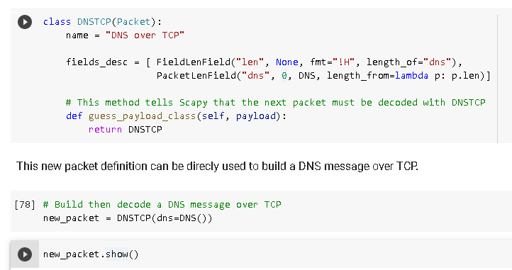

# SCAPY

trying for arp poisoning 
https://medium.com/datadriveninvestor/arp-cache-poisoning-using-scapy-d6711ecbe112

network scanning using scapy.

A collab notebook on scapy here: https://colab.research.google.com/drive/1Dr7hmbPBmiiXCl-dnQE9XhaPbewqMRCN#scrollTo=CH_L_yO2DLBH

