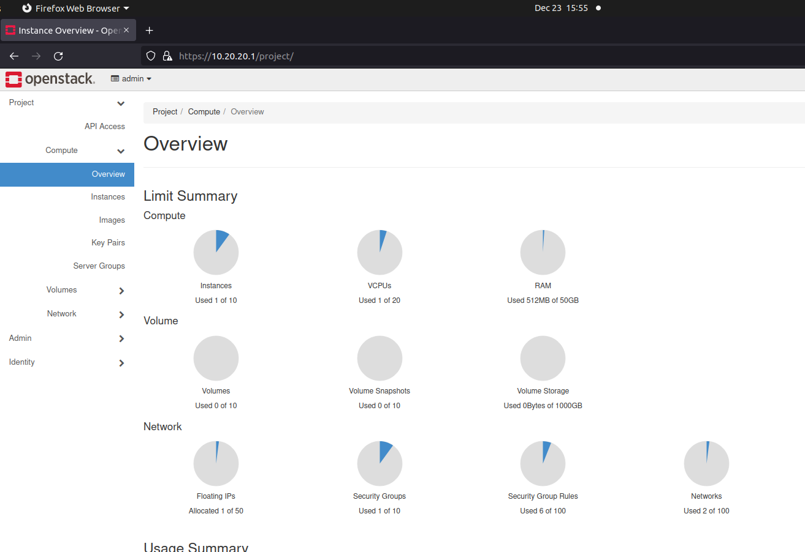
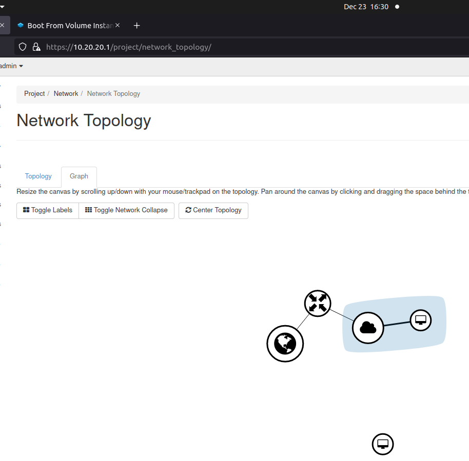
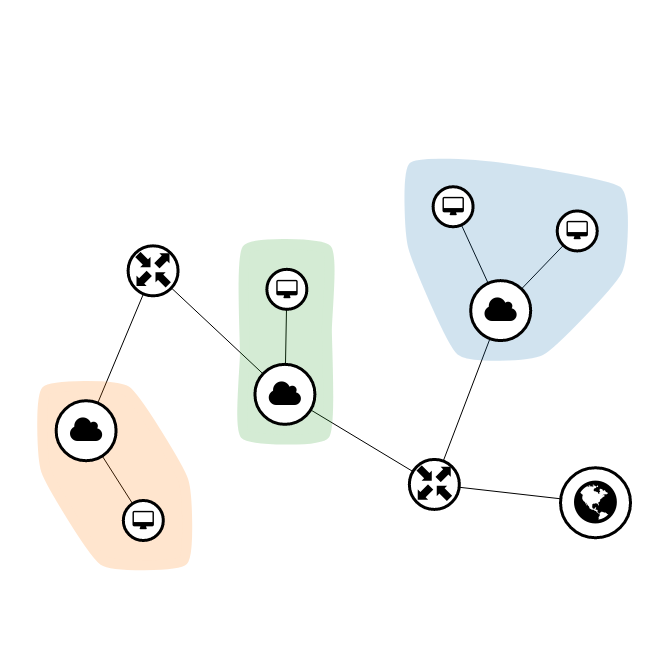

# Trying openstack solutions

## Microstack

https://ubuntu.com/openstack/install

gives you openstack instance in the machine itself
A small public cloud

In order to run :
`microstack launch cirros -n test`

user : admin
password : sudo snap get microstack config.credentials.keystone-password

How to use microstack to create a cyber range?

for adding a new vm

`microstack launch cirros -n apollo`

The microstack server is available at

`https://10.20.20.1`

Creating a sample network

