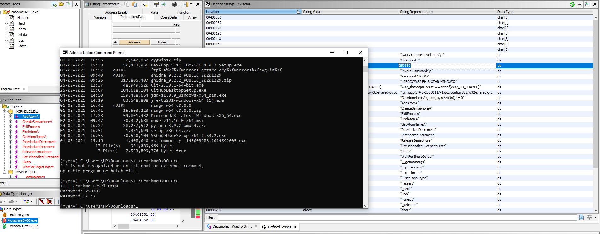

# trying tryhackme reverse engineering challenges

You can get all the challenges from : 
https://github.com/Maijin/radare2-workshop-2015/blob/master/IOLI-crackme/bin-win32/

1. level 0

reference for ghidra : https://www.shogunlab.com/blog/2019/04/12/here-be-dragons-ghidra-0.html